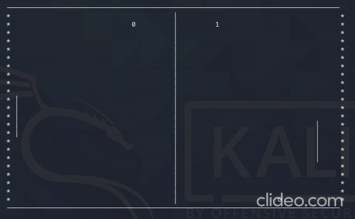

# Pong

Pong clone, written in C++ and used nCurses library.

## Disclamier
This project is written on Linux operating system and has not been tested on any other operating system.

## Dependencies
In order for the project running, you need to include **nCurses library** to your machine.

## Installation
Clone this repository to your local directory:
`git clone https://github.com/dogukanteber/Pong.git`

Run make command and start the game:
`make && ./pong`

## How to Play
Paddles are controled using <kbd>W</kbd>,<kbd>S</kbd> keys for left player and <kbd>↑</kbd>,<kbd>↓</kbd> keys for right player. To quit the game, press <kbd>Q</kbd>. To shoot the ball, press <kbd>Space</kbd>. Shooting the ball is same for both players.
